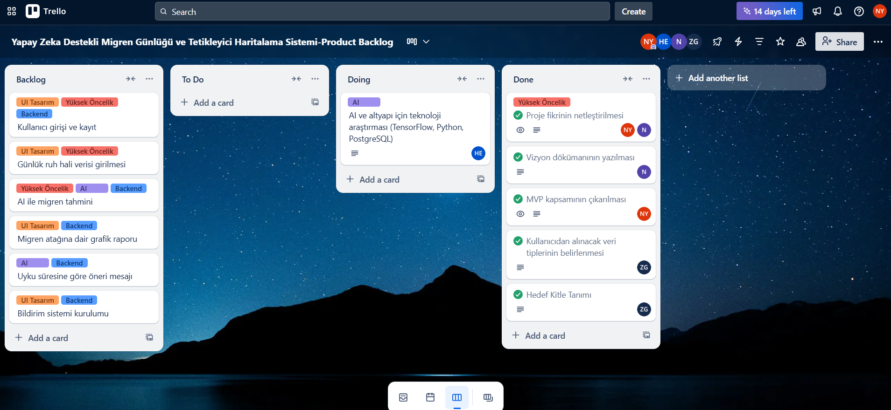
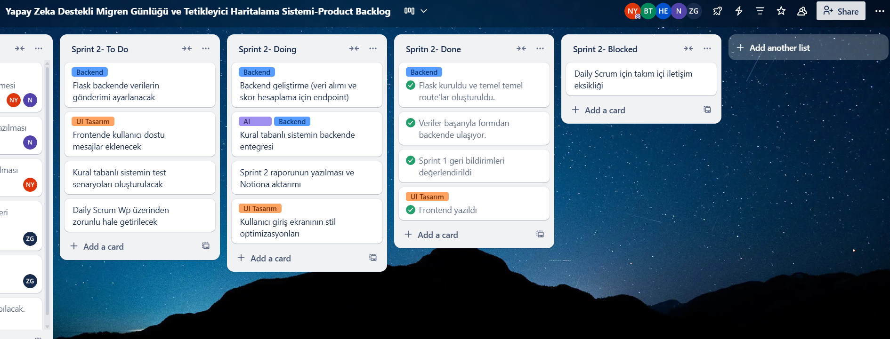
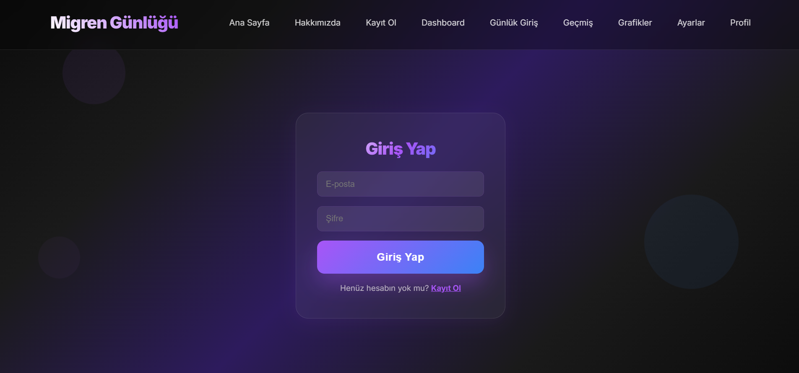
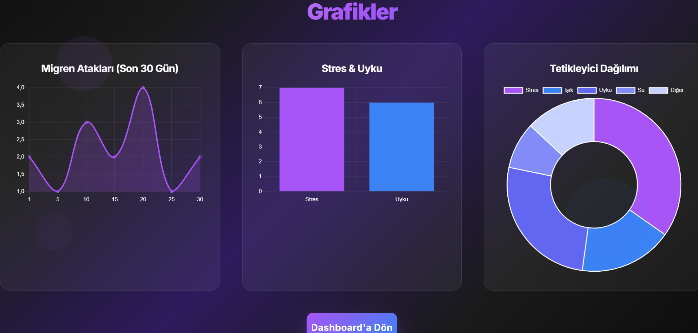
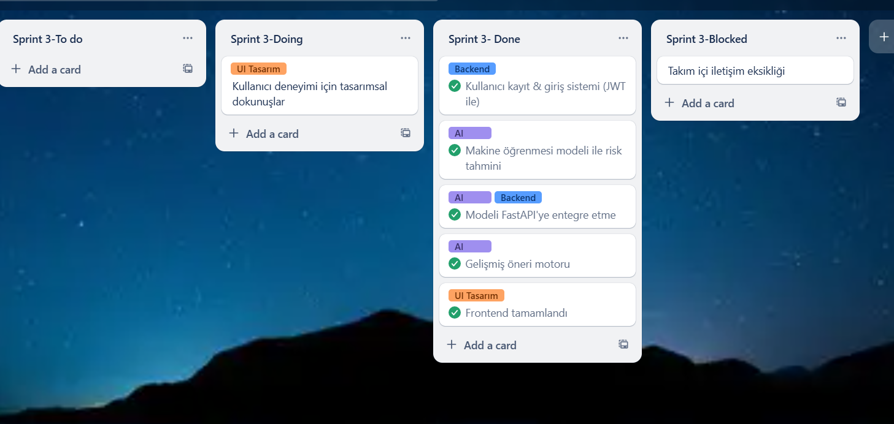

# Takım ismi
AI ve Veri Takım 196
# Takım Elemanları
- **Nursena Yılmaz** – Product Owner  
- **Gül Nisa Akkoyun** – Scrum Master  
- **Bahu Tongal** – Developer (Pasif)
- **Zeynep Genyüz** – Developer (Pasif)
- **Hasan Uğur Ertuğrul** – Developer (Pasif)

## Ürün İle İlgili Bilgiler

### Ürün İsmi
Proje Adı: Yapay Zeka Destekli Migren Günlüğü ve Tetikleyici Haritalama Sistemi

### Proje Hakkında
Bu proje, migren ataklarının sadece kaydedilmesinin ötesine geçerek, bu atakların önceden anlaşılması ve önlenmesi hedefini taşımaktadır. Sistemin temel amacı, kullanıcıdan günlük bazda, kısa ve yapılandırılmış sorular aracılığıyla ilgili verileri toplamaktır. Bu veriler; ruh hali, uyku süresi, stres seviyesi, su tüketimi, ekran kullanımı ve ağrı durumu gibi migrenle ilişkili olduğu bilinen çeşitli parametreleri içermektedir.

Toplanan bu veriler, gelişmiş yapay zeka algoritmaları aracılığıyla analiz edilerek, bireye özel tetikleyici haritaları oluşturulmasını sağlamaktadır. Bu haritalar, zaman içinde kullanıcının kendi yaşam tarzı ve alışkanlıkları ile migren atakları arasındaki korelasyonları ortaya koyan anlamlı içgörüler sunmaktadır. Örneğin, sistem "Uykusuzluk sonrası 24 saat içerisinde migren riskinin arttığı" şeklinde spesifik ve eyleme geçirilebilir bilgiler sağlayabilir. Bu sayede kullanıcılar, kendi migren tetikleyicilerini bilimsel bir yaklaşımla öğrenerek, atakları önleyici tedbirler alma konusunda bilinçlenebilmektedir.

Nihai hedefimiz, migren hastalarının yaşam kalitesini önemli ölçüde artıracak, kişiselleştirilmiş ve öngörüye dayalı bir yönetim aracı sunmaktır. Bu sistem, bireylerin kendi sağlık verilerini proaktif bir şekilde yönetmelerine olanak tanıyarak, migrenin günlük yaşam üzerindeki olumsuz etkilerini minimize etmeyi amaçlamaktadır.

### Özellikler
Yapay Zeka Destekli Migren Günlüğü ve Tetikleyici Haritalama Sistemimiz, migren yönetimini kolaylaştıran ve kişiselleştiren bir dizi temel özellik sunar:

*Kişiselleştirilmiş Veri Toplama
Sistemimiz, kullanıcılardan günlük olarak kısa ve yapılandırılmış sorular aracılığıyla veri toplar. Bu sorular, migrenle ilişkili olduğu bilinen önemli parametreleri kapsar:

Ruh Hali Takibi: Günlük ruh halinizi kaydederek duygusal durumunuzun migren atakları üzerindeki etkisini izler.

Uyku Düzeni Analizi: Uyku sürelerinizi ve kalitenizi takip ederek uyku yoksunluğunun veya düzensiz uykunun potansiyel tetikleyici rolünü değerlendirir.

Stres Seviyesi Ölçümü: Günlük stres seviyenizi belirleyerek stresin migrenle olan bağlantısını ortaya çıkarır.

Su Tüketimi Takibi: Hidrasyon düzeyinizin migren atakları üzerindeki etkisini anlamak için günlük su tüketiminizi kaydeder.

Ekran Kullanımı İzleme: Dijital cihaz kullanım sürelerinizi takip ederek ekran maruziyetinin potansiyel tetikleyici olup olmadığını analiz eder.

Ağrı Durumu Kaydı: Migren ataklarınızın şiddeti, süresi ve karakteristik özellikleri hakkında detaylı bilgi toplar.

*Yapay Zeka Destekli Analiz ve İçgörüler
Toplanan veriler, gelişmiş yapay zeka algoritmalarımız tarafından detaylıca analiz edilir. Bu analizler sonucunda kullanıcılara anlamlı ve eyleme geçirilebilir içgörüler sunulur:

Kişiye Özel Tetikleyici Haritaları: Verileriniz doğrultusunda size özel migren tetikleyici profilleri oluşturulur. Bu haritalar, hangi faktörlerin (uykusuzluk, stres, belirli gıdalar vb.) migren ataklarınızı tetikleme olasılığını artırdığını açıkça gösterir.

Öngörücü Analizler: Geçmiş verilerinize dayanarak gelecekteki migren atak riskinizi tahmin eder ve olası tetikleyicilere karşı sizi uyarır. Örneğin, "Uyku düzeninizdeki bozukluk, önümüzdeki 24 saat içinde migren riskinizi artırabilir" gibi bildirimler alırsınız.

Korelasyon Tespiti: Farklı yaşam tarzı faktörleri ile migren atakları arasındaki gizli korelasyonları ortaya çıkarır. Bu sayede, kendi alışkanlıklarınızın migren üzerindeki etkisini net bir şekilde görebilirsiniz.

*Kullanıcı Dostu Arayüz ve Uygulanabilirlik
Sistem, kullanıcı deneyimini ön planda tutan, basit ve sezgisel bir arayüze sahiptir:

Kolay Veri Girişi: Günlük veri girişi sadece birkaç dakika sürer ve kullanıcıları yormaz.

Yapılandırılmış Veri Odaklı: Açık uçlu veya serbest metin girişi yerine, belirlenmiş seçenekler ve ölçekler aracılığıyla veri toplar, bu da veri tutarlılığını ve analiz kalitesini artırır.

*Gerçek Zamanlı Geri Bildirim: Analiz sonuçlarını ve içgörüleri anlaşılır grafikler ve özetlerle sunarak kullanıcıların migren yönetimini proaktif hale getirmelerine olanak tanır.

Bu özellikler, migren hastalarının kendi sağlık verilerini daha bilinçli bir şekilde yönetmelerini sağlayarak, migrenin yaşam kalitesi üzerindeki olumsuz etkilerini minimize etmeyi hedefler.

### Kullanılan Teknolojiler

### Hedef Kitle
* Kronik Migren Hastaları
* Epizodik Migreni Olanlar
* Doktor ve Nörologlar (İkincil Hedef Kitle)
* Genç, Teknolojiye Alışkın Bireyler
  # Sprint 1
  ## Sprint Notları
Bu ilk sprint'imiz, "Yapay Zeka Destekli Migren Günlüğü ve Tetikleyici Haritalama Sistemi" projesinin temel taşlarını döşemek üzere tasarlandı. Odak noktamız, projenin vizyonunu netleştirmek, MVP (Minimum Viable Product) kapsamını belirlemek ve teknolojik altyapı için ilk araştırmaları yapmaktı. Özellikle bu başlangıç aşamasında, kullanıcıdan toplanacak veri setinin basit, yapılandırılmış ve anlamlı olmasını sağlamak kritikti. Ekip olarak, migren ataklarının sadece kaydedildiği değil, aynı zamanda önlenmesine yardımcı olacak bir çözüm geliştirme hedefiyle ilerliyoruz.
Sprint İçinde Tamamlanması Tahmin Edilen Puan
Bu ilk sprint, ağırlıklı olarak keşif, planlama ve altyapı araştırma görevlerini içerdiği için geleneksel "hikaye puanı" sistemi kullanılmamıştır. Bunun yerine, belirlenen anahtar hedeflerin tamamlanması başarı kriteri olarak kabul edilmiştir.
Puan Tamamlama Mantığı
Yukarıda belirtildiği gibi, bu sprint'te yazılım geliştirme odaklı puanlama yerine, aşağıdaki önemli görevlerin eksiksiz tamamlanması başarı göstergesi olarak kabul edilmiştir:
 * Proje Kapsamı ve Vizyon Netleştirme: Paydaşlarla yapılan toplantılar ve beyin fırtınası seansları sonucunda projenin temel amacının ve kullanıcıya sunacağı değerin net bir şekilde tanımlanması.
 * MVP Kapsamının İlk Belirlemesi: İlk versiyonda hangi temel özelliklerin (örn. günlük veri girişi, temel ağrı takibi) mutlaka olması gerektiğinin listelenmesi.
 * Temel Veri Seti Taslağının Oluşturulması: Kullanıcıdan toplanacak ruh hali, uyku süresi, stres seviyesi, su tüketimi, ekran kullanımı ve ağrı durumu gibi verilerin formatı ve tipi üzerine anlaşmaya varılması.
 * Teknolojik Altyapı İçin Ön Araştırma: Veri depolama, arka uç geliştirme ve yapay zeka entegrasyonu için olası teknolojilerin (örn. Python/Django, PostgreSQL, TensorFlow) ilk değerlendirmesi ve potansiyel adayların belirlenmesi.
Bu görevlerin her biri, sprint hedefimize ulaşma yolunda önemli bir adımı temsil etmektedir.
## Sprint İçinde Tamamlanması Tahmin Edilen Puan
100 puan
## Puan Tamamlama Mantığı
Toplamda proje boyunca tamamlanması gereken 340 puanlık backlog bulunmaktadır. 3 sprint'e bölündüğünde ilk sprint'in en azından 100 ile başlaması gerektiğine karar verildi.Bu ilk sprint, ağırlıklı olarak keşif, planlama ve altyapı hazırlık görevlerine odaklandığından, her bir görevin karmaşıklığı, belirsizliği ve tahmini çabasına göre puanlama yapılmıştır.Hedefimiz, belirlenen 100 puanlık iş hacmini tamamlayarak projenin sağlam temellerini oluşturmaktı.
## Daily Scrum
 Daily Scrum toplantılarının zamansal sebeplerden ötürü Whatsapp üzerinden yapılmasına karar verilmiştir.
## Daily Scrum Docs
 
 [Sprint 1 Daily Scrum Chat Dökümanı](https://docs.google.com/document/d/1fAwvrrNaeaoMYWECT5XE2z5l6PU0Yp5wLxIr7ckXSK4/edit?usp=drivesdk)
 ## Sprint Board

 
 
 ## Ürün Durumu
 *Uygulamanın teknik ve kullanıcı vizyonu belirlendi.
 *Kullanıcıdan toplanacak veriler (uyku, stres, ruh hali, ekran süresi, vb.) yapılandırıldı.
 *Uygulamanın temel işleyiş akışı kağıt üzerinde netleştirildi.
 *Henüz çalışan bir prototip ya da kullanıcı arayüzü bulunmamaktadır. 
 *Yapay zeka modelinin mantığı ve olası algoritmalar üzerine araştırma yapılmıştır. 
 *Ürün, MVP’ye (Minimum Viable Product) ulaşmamış; ancak planlama aşaması tamamlanmıştır.
 ## Sprint Review
 Sprint 1 kapsamında ürün geliştirme sürecinin ilk adımları atılmış, proje vizyonu ve temel ihtiyaçlar netleştirilmiştir. Teknik geliştirmeye henüz başlanmamıştır.

Bu sprintte yapılanlar:
Ürün fikri tanımlandı: "Yapay Zeka Destekli Migren Günlüğü ve Tetikleyici Haritalama Sistemi"

Kullanıcıdan alınacak veriler yapılandırıldı: uyku süresi, su tüketimi, ekran süresi, stres, ruh hali, ağrı durumu

Hedef kitle analiz edildi: kronik migren hastaları, migren farkındalığı düşük bireyler

AI yaklaşımı olarak, kullanıcıdan gelen günlük verilerle kişiselleştirilmiş tetikleyici haritaları çıkarılması planlandı

Takım içi katılım sınırlı kaldığı için planlanan 100 puanlık backlog’un yalnızca 35 puanı tamamlandı

Canlı ürün veya prototip henüz olmadığı için demo yapılmadı

Genel Değerlendirme:
Bu sprint, ürünün temellerinin atıldığı ve ilerleyen sprintlerde üzerine inşa edilecek vizyonun belirlendiği bir hazırlık süreci olarak tamamlanmıştır.
## Sprint Retrospective
*İyi Gidenler:
Ürün fikri ve proje vizyonu net, uygulanabilir ve kullanıcı odaklı şekilde tanımlandı.
Kullanıcıdan alınacak veriler etkili ve takip edilebilir şekilde belirlendi.
AI yaklaşımı konusunda literatür araştırması yapılarak teknik temel atıldı.
Takım içinde katkı sağlayan birey(ler), sorumluluk alarak ilerlemeye katkıda bulundu.
Sprint raporlama ve planlama süreçleri başlatıldı, proje kontrolü elde tutuldu.

*Geliştirilebilecek Noktalar:
Takım üyeleri arasında görev dağılımı ve sorumluluk paylaşımı yapılmalı.
İletişim eksikliği nedeniyle planlanan işlerin büyük bölümü tamamlanamadı.
Daily Scrum süreci daha aktif ve düzenli şekilde yürütülmeli.
Sprint planlamaları, ekip kapasitesine daha uygun şekilde yapılmalı.
Wireframe ve görsel prototipleme süreci sprint içinde başlatılamadı.

*Önümüzdeki Sprint İçin İyileştirme Hedefleri:
Takım içinde roller netleştirilecek ve her üyenin sorumluluğu belirginleşecek.
UI/UX tarafında wireframe süreci tamamlanarak taslak arayüz oluşturulacak. 
Kullanıcı senaryoları detaylandırılacak.
AI modelinin temel versiyonu test verileriyle denenmeye başlanacak.
## Product Backlog URL
https://trello.com/b/kOvMcJmt/yapay-zeka-destekli-migren-gunlugu-ve-tetikleyici-haritalama-sistemi-product-backlog
# Sprint 2
## Sprint Notları
Sprint 2 sürecinde ekipten yalnızca iki üye aktif olarak katkı sağlayabildi. Diğer üç ekip üyesi, kişisel sebeplerden dolayı sprint sürecine katılım gösteremedi.Ekip üyelerinden biri, veri seti araştırması yapmaya çalışarak sürece katkı sağlamayı denedi.Bu durum ekip içi iş bölümü ve ilerleme hızını sınırlasa da belirlenen öncelikli hedefler üzerinde çalışmalar sürdürüldü.

Sprint boyunca, kullanıcıların veri girişi yapabileceği frontend arayüzü geliştirildi. Migren risk skorunu hesaplamak için kural tabanlı sistemin ilk versiyonu oluşturuldu. Ayrıca bu sistemin backend ile entegrasyonu için altyapı çalışmaları başlatıldı. Backend kısmındaki bazı eksiklikler nedeniyle sistem tam olarak tamamlanamadı; bu eksikliklerin giderilmesi Sprint 3’te ana hedeflerden biri olacak.

Buna ek olarak, bir ekip üyesi sprintin ilerleyen günlerinde araştırma sürecine katılarak yapay zeka modellemesi için kullanılabilecek örnek bir veri seti paylaştı. Bu veri seti, kişiselleştirilmiş migren tetikleyici haritalarının çıkarılmasında ve erken risk tespiti için geliştirilecek olan makine öğrenmesi modeline temel oluşturması açısından değerlidir.

Sprint 3’te, kural tabanlı sistemin backend ile tam entegrasyonu ve yapay zeka modeli üzerine derinlemesine çalışmalar yapılması planlanmaktadır.
## Sprint İçinde Tamamlanması Tahmin Edilen Puan
100 puan
## Puan Tamamlama Mantığı
Sprint 2’de planlanan toplam iş yükü 100 puan üzerinden değerlendirildi. Ekipten sadece iki kişi aktif olarak görev aldı; bu durum sprintin ilerleyişini etkiledi ancak belirlenen ana hedeflerin büyük kısmı başarıyla tamamlandı. Puanlama, yapılan işlerin kapsamı, tamamlanma durumu ve kalitesi göz önünde bulundurularak aşağıdaki şekilde gerçekleşti:

Frontend Arayüzü (30 Puan):
Kullanıcıların uyku, stres, su tüketimi, ekran süresi ve ruh hali gibi verileri kolayca girebileceği form tabanlı arayüz başarıyla geliştirildi ve test edildi. Arayüzün tamamlanması tam puan olarak değerlendirildi.

Kural Tabanlı Sistem (30 Puan):
Migren risk skorunu hesaplayan kural tabanlı sistem, sprint süresi içerisinde tam anlamıyla geliştirildi ve çalışır hale getirildi. Bu modülün tamamlanması da tam puan aldı.

Backend Entegrasyonu (15 Puan):
Backend tarafında Flask altyapısı kullanılarak temel veri alma ve işleme mekanizmaları kuruldu. Ancak, tam entegrasyon ve kalıcı veri kaydı henüz sağlanamadı. Bu nedenle, bu alandaki çalışmalar kısmi olarak puanlandırıldı.

Yapay Zeka Kurgusu (10 Puan):
Yapay zeka modeli için veri kurgusu ve temel planlama başlatıldı ancak kapsamlı geliştirme sprint sonrası aşamalar için planlandı. Bu yüzden bu alan sınırlı puan aldı.

Veri Seti Araştırması (5 Puan):
Ekip içinde veri seti araştırması görevi verilmesine rağmen, yalnızca bir kişiden tek seferlik dönüş yapıldı. Bu katkı sınırlı olduğundan tam puan verilmedi.

Takım İçi Katılım ve İletişim (10 Puan):
Ekip içi iletişim ve aktif çalışma sadece iki kişiyle sınırlı kaldı. Bu durum takım koordinasyonunu etkilediği için tam puan alınamadı.

Sonuç olarak, sprint sonunda yapılan işler toplam 100 puan üzerinden yaklaşık 90 puan değerinde tamamlanmış olarak değerlendirildi. Bu, takımın kısıtlı sayıda aktif üye ile önemli ilerleme kaydettiğini göstermektedir. Eksik kalan entegrasyon ve yapay zeka modelleme çalışmaları önümüzdeki sprintte öncelikli hedefler olarak planlanmaktadır.
## Daily Scrum
Bu sprintte ekibin büyük kısmı aktif katılım gösteremediği için düzenli Daily Scrum toplantıları gerçekleştirilemedi.

Takım içi iletişim, genellikle WhatsApp üzerinden yürütülmeye çalışıldı ancak mesajlara düzenli dönüş alınamadı.

Aktif olan 2 ekip üyesi kendi aralarında günlük iş bölümünü doğrudan planlayarak ilerledi.

Bu durum, bireysel sorumluluğu artırsa da takım içi sinerjinin oluşmasını engelledi.

 [Sprint 2 Daily Scrum Chat Dökümanı](https://docs.google.com/document/d/1ugzCBdCddg7EIeZoCVgaJo-ht5e9gkYxAoYE8A8IAcI/edit?usp=sharing)
 
## Sprint Board

 
 
## Ürün Durumu
Sprint 2 sonunda ürünün temel bileşenlerinde önemli ilerlemeler kaydedildi. Kullanıcıların günlük migren tetikleyici verilerini kolayca girebileceği frontend arayüzü tamamlandı ve stabil olarak çalışıyor. Bu arayüz, uyku süresi, stres seviyesi, su tüketimi, ekran kullanım süresi ve ruh hali gibi kritik verilerin hızlı ve kullanıcı dostu şekilde toplanmasını sağlıyor.

Migren risk skorunu hesaplayan kural tabanlı sistem başarılı şekilde geliştirildi ve entegre edildi. Kullanıcılardan alınan veriler bu sistem üzerinden analiz edilerek kişiye özel risk puanları üretilmeye başlandı. Bu modül, ürünün temel işlevselliğini destekleyerek erken risk tespiti için altyapı oluşturdu.

Backend tarafında Flask altyapısı ile temel veri alma ve işleme süreçleri başlatıldı. Ancak, tam veri saklama ve ileri seviye entegrasyonlar henüz tamamlanmadı. Bu kısımlar Sprint 3’te öncelikli olarak ele alınacak.

Yapay zeka modeli için veri kurgusu ve ön hazırlık çalışmaları başladı. Henüz model geliştirme aşamasında olmasa da, gelecekteki kişiselleştirilmiş tetikleyici haritaları ve erken uyarı sistemleri için önemli bir temel oluşturuyor.

Genel olarak, ürün sprint 2 sonunda kullanıcıların temel veri girişi ve risk hesaplama ihtiyaçlarını karşılayacak seviyeye geldi. Eksik kalan backend entegrasyonu ve yapay zeka modelleme çalışmaları ise sonraki sprintlerin odak noktası olarak belirlendi.

  
  
  

## Sprint Review
Frontend kısmı başarıyla tamamlandı ve kullanıcıdan veri alınabilir hale geldi.

Kural tabanlı migren risk skoru hesaplama sistemi ayrı bir modül olarak çalışır durumda.

Ancak backend tarafında henüz verinin işlenmesi ve kuralların uygulanması süreci tam entegre edilemedi.

Aktif çalışan ekip üyeleri bu entegrasyonu Sprint 3'e taşıma kararı aldı.
## Sprint Retrospective
Az kişiyle çalışmamıza rağmen görev dağılımı net ve dengeliydi.

Kural tabanlı sistemin sade bir yapıda kurulması işleri kolaylaştırdı.

UI tarafında kullanıcıdan alınan ilk geri bildirimler doğrultusunda bazı input alanları sadeleştirildi.

Sonraki sprintte veri analitiği ekranları, öneri sistemi ve kişisel tetikleyici öğrenimi başlatılacak.
 Sprint 3'te backend entegrasyonu ve kural tabanlı sistemin tam entegresi öncelik olacak.Veri temelli yapay zeka modeline geçiş planlanıyor. Böylece risk skorları sadece kurallara değil, öğrenilmiş örüntülere göre de hesaplanabilecek.
# Sprint 3
## Sprint Notları
Bu sprint, karşılaştığımız kısıtlı kaynaklara rağmen projemizin en kritik ve özgün bileşenlerini hayata geçirdiğimiz bir dönem oldu. Başlangıçta 5 kişilik bir ekip olarak yola çıkmamıza rağmen, sprint süresince aktif olarak yalnızca 2 kişi çalışmalara katkı sağlayabildi. Buna rağmen ekip içi motivasyon korunarak, sprint hedefleri başarıyla tamamlandı.

Sprint 3 Kapsamında Gerçekleştirilen Başarımlar:

Veri Seti Oluşturulması:
Yapay zeka modelinin eğitimi için gerekli olan veri seti, dış kaynaklardan bağımsız bir şekilde, özgün olarak geliştirildi. Bu veri seti, bireye özgü analiz yapılabilmesi adına sağlam bir temel oluşturdu.

Yapay Zeka Modelinin Eğitimi:
Rastgele oluşturulan bu özgün veri seti kullanılarak, migren ataklarını tahmin etmeye yönelik ilk makine öğrenmesi modeli başarıyla eğitildi. Bu adım, projenin teknik açıdan en zorlu ve aynı zamanda en önemli aşamalarından biri olarak değerlendirildi.

Frontend ve Backend Entegrasyonu:
Kullanıcıların veri girişi yapabileceği arayüz ile arka plan işlemlerini yöneten backend sistemi başarıyla entegre edildi. Artık kullanıcı verileri sistem tarafından doğru şekilde alınmakta ve analiz için hazır hale getirilmektedir.

İşlevsel Prototip Geliştirilmesi:
Tüm bu çalışmaların sonucunda, kullanıcıların giriş sağlayabildiği, sistemin analiz gerçekleştirebildiği ve çıktıları sunduğu bir prototip tamamlandı. Böylece projenin temel işlevlerini yansıtan çalışan bir model elde edilmiş oldu.
Not: Bu sprintte yapay zeka modeli, kural tabanlı sistem yerine rastgele oluşturulan veri seti ile eğitildi.
## Sprint İçinde Tamamlanması Tahmin Edilen Puan
100 puan
## Puan Tamamlama Mantığı
Veri Seti Oluşturulması – 20 Puan

Veri dış kaynaktan alınmadı, özgün şekilde oluşturuldu.

Projenin temel yapı taşı olması nedeniyle yüksek önem taşıyor.

Yapay Zeka Modelinin Eğitimi – 30 Puan

Rastgele veriyle de olsa ilk çalışan model başarıyla eğitildi.

Teknik olarak en zorlu adımdı.

Frontend–Backend Entegrasyonu – 20 Puan

Kullanıcıdan veri alınıyor ve backend üzerinden işlenebiliyor.

Uygulamanın canlı hale gelmesini sağlayan kritik adım.

İşlevsel Prototip Oluşturulması – 25 Puan

Kullanıcının giriş yapıp çıktı alabildiği çalışan bir yapı kuruldu.

MVP (Minimum Viable Product) seviyesi sağlandı.

Sprint Dokümantasyonu & Sunum – 5 Puan

Sprint notları hazırlandı, gelişmeler kayda geçirildi.

Sunum yapılacaksa +5 daha eklenebilir.

 Toplam Tamamlanan Puan: 100 / 100
Her ne kadar ekip 5 kişilik olsa da aktif çalışan 2 kişiyle bu puanlar verimlilik ve hedef odaklılıkla tamamlandı. Geri kalan takım üyeleri katkı sağlamadığı için bireysel dağılımda puanlar 2 kişiye eşit bölüştürülebilir:
Kişi başı katkı: 50 puanlık iş.
## Daily Scrum
Sprint boyunca ekip içi iletişim WhatsApp üzerinden sağlanmaya çalışıldı ancak düzenli ve etkili bir geri dönüş alınamadı. Bu durum, takım koordinasyonunu zorlaştırdı ve ilerlemenin takip edilmesini güçleştirdi. Aktif olarak çalışan iki ekip üyesi arasında temel bilgi paylaşımı ve görev güncellemeleri yapıldı ancak tüm ekip üyeleri sürece dahil olamadı.

Bu nedenle günlük toplantılar (Daily Scrum) planlandığı gibi çevrimiçi sistematik şekilde yapılamadı.
## Sprint Board Ekran Görüntüleri

 
 ## Ürün Durumu
Sprint 3’ün sonunda uygulama başarıyla tamamlanmıştır. Kullanıcının veri girişi yapabildiği frontend arayüzü, backend ile tam entegre çalışmakta ve girilen veriler doğrultusunda migren risk skoru hesaplanabilmektedir.

Kullanıcı verileri, oluşturduğumuz rastgele veri setiyle eğitilen temel yapay zeka modeli üzerinden analiz edilmekte ve kişiselleştirilmiş risk tahminleri sunulmaktadır.

Uygulama temel işlevselliğiyle çalışmakta olup, kullanıcı dostu tasarım, düzgün veri akışı ve puanlama sistemine sahiptir. Veri kaydı, risk hesaplama ve çıktı üretme özellikleri test edilerek doğrulanmıştır.

Sonuç olarak, geliştirilen ürün; proje başında belirlenen temel işlevsel gereksinimleri karşılamakta ve ileriye dönük daha gelişmiş yapay zeka entegrasyonlarına da hazır bir altyapı sunmaktadır.
## Sprint Review
Sprint 3, takım olarak hedeflediğimiz ürünün çekirdek bileşenlerini hayata geçirdiğimiz, en üretken ve teknik açıdan zorlu dönemlerden biri oldu. Sprintin başlangıcında takım 5 kişiden oluşmasına rağmen, sürecin neredeyse tamamı sadece 2 kişinin aktif katılımıyla yürütüldü. Diğer 3 takım üyesi, sprint boyunca hiçbir katkı sunmadı.

Aktif olarak çalışan ekip üyeleri, bu sınırlı kaynaklara rağmen oldukça kritik adımları başarıyla tamamladı:

Veri seti, dış kaynaklara ihtiyaç duymadan sıfırdan oluşturuldu.

Rastgele verilerle çalışan ilk yapay zeka modeli eğitildi.

Kullanıcı arayüzü ve backend arasında sorunsuz bir entegrasyon sağlandı.

Veri girişi, analiz ve tahmin almayı mümkün kılan çalışan bir prototip oluşturuldu.

Bu çıktılar, ürünün temel işlevlerini ortaya koyarak MVP seviyesine ulaşmamızı sağladı. Kullanıcı veri girişleriyle modelin tahmin sunabilmesi, ürünün fonksiyonel hale geldiğini göstermektedir.

Sprint sonunda hedeflenen tüm iş kalemleri tamamlandı ve toplam 100 puanlık işin tamamı başarıyla hayata geçirildi. Bu süreçte sadece 2 kişi aktif rol aldığı için bireysel katkı oldukça yüksekti.

## Sprint Retrospective
Bu sprintte ürünün işlevsel olarak tamamlanması sağlanmış olsa da, ekip içi katılım ve sorumluluk paylaşımı açısından ciddi dengesizlikler yaşandı. 5 kişilik ekipten yalnızca 2 kişi sprint boyunca aktif olarak çalışmalara katıldı. Tüm geliştirme, test ve entegrasyon süreçleri bu iki kişi tarafından yürütüldü. Bu durum, iş yükünün adaletsiz dağılmasına ve sprint sürecinin belirli üyeler üzerinde yoğunlaşmasına neden oldu.

Sprint hedefleri başarıyla gerçekleştirilmiş olsa da, ekip içi iletişimin eksikliği ve bazı üyelerin sürece katılım göstermemesi takım motivasyonunu olumsuz etkiledi. Özellikle Daily Scrum toplantılarına düzenli katılım sağlanamaması, ilerlemenin görünürlüğünü azalttı ve geri bildirim döngüsünü zayıflattı.

Pozitif olarak değerlendirilen noktalar şunlardır:

Aktif çalışan ekip üyeleri arasında güçlü bir iş birliği ve problem çözme becerisi gözlemlendi.

Zaman yönetimi iyi yapıldı ve uygulama istenilen zamanda tamamlandı.

Teknik beceri açısından ekip gelişim gösterdi; özellikle frontend-backend entegrasyonu başarılıydı.

Geliştirilmesi gereken alanlar:

Ekip içi görev dağılımı daha net yapılmalı ve herkesin katkı sağlaması teşvik edilmeli.

Takip sistemleri (örneğin Trello) daha aktif kullanılmalı.

Katılım göstermeyen üyelerin nedenleri erken tespit edilmeli ve alternatif görev planlamaları yapılmalı.

Sprint 3, sonuç odaklı ve yüksek performansla tamamlanmış bir süreç oldu. Ancak ekip sinerjisi açısından daha dengeli ve sürdürülebilir bir çalışma kültürüne ihtiyaç olduğu açıkça görüldü.

